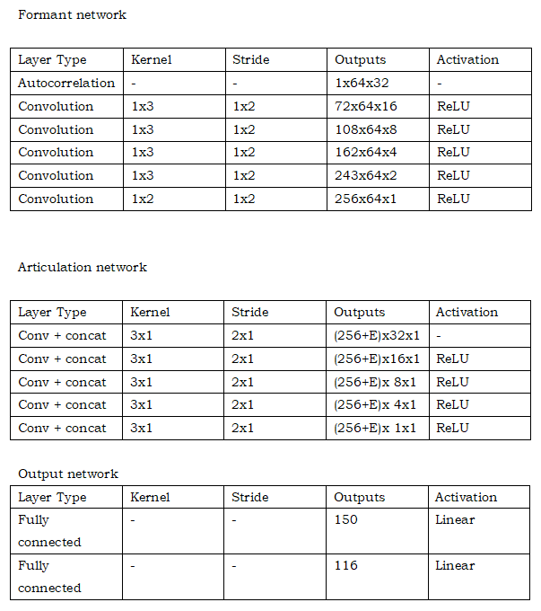

# Audio2Face

## Discription
---

A tensorflow implementation of Nvidia's paper "Audio-Driven Facial Animation by Joint End-to-End Learning of Pose and Emotion".

In the orginal paper above, the output is vextex , our version that we've changed it to the blendshapes' weights.

## Base Module
---

We use the framework introduced in [Audio-Driven Facial Animation by Joint End-to-End Learning of Pose and Emotion] and the same loss functions,but used the blendshapes' weights instead of vertices.

## Usage
---

### Input data

Use ExportBsWeights.py to export weights file from Maya.Then we can get BS_name.npy and BS_value.npy .

Use step1_LPC.py to deal with wav file to get lpc_*.npy .
Preprocess the wav to 2d data.

### train

we recommand that uses FACEGOOD avatary to produces trainning data.its fast and accurate.
http://www.avatary.com

the data for train is stored in dataSet1 

> python step14_train.py --epochs 8 --dataSet dataSet1

### test

In folder /test,we supply a test application named AiSpeech.  
wo provide a pretrained model,zsmeif.pb  
In floder /example/ueExample, we provide a packaged ue project that contains a digit human created by FACEGOOD can drived by /AiSpeech/zsmeif.py.

you can follow the steps below to use it:
1.  make sure you connect the microphone to computer.
2.  run the script in terminal. 
    > python zsmeif.py
3.  when the terminal show the message "run main", please run FaceGoodLiveLink.exe which is placed in /example/ueExample/ folder.
4.  click and hold on the left mouse button on the screen in UE project, then you can talk with the AI model and wait for the voice and animation response. 

## Dependences

tersorflow-gpu 1.15

python-libs:
    pyaudio
    requests
    websocket
    websocket-client

## Data
---

The testing data, Maya model, and ue4 test project can be downloaded from the link below.

[data_all](https://pan.baidu.com/s/1CGSzn639PUE7cUYnX4I3fQ) code : n6ty

[GoogleDrive](https://drive.google.com/drive/folders/1r7b7sfMebhtG0NSZk1yHzMaHRosb8xd1?usp=sharing)

## Reference
---
[Audio-Driven Facial Animation by Joint End-to-End Learning of Pose and Emotion](chrome-extension://oemmndcbldboiebfnladdacbdfmadadm/https://research.nvidia.com/sites/default/files/publications/karras2017siggraph-paper_0.pdf)

## License

Audio2Face Core is released under the terms of the MIT license.See COPYING for more information or see https://opensource.org/licenses/MIT.
